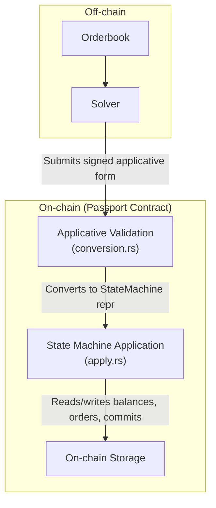

# Superposition Passport

Superposition Passport is an on-chain UTXO-based settlement layer for an off-chain order
book and matching engine. It validates cryptographic proofs of state transitions and moves
asset ownership on-chain after orders are matched off-chain by a solver. The contract
compiles to WASM and targets Arbitrum Stylus-compatible chains via the `bobcat-sdk`.

## How It Works

The system models every asset interaction as a chain of UTXO-like state transitions, each
authenticated by ed25519 signatures. An off-chain matching engine (the **solver**) pairs
orders, then submits the full lineage of operations on-chain where the contract validates
signatures, checks constraints, and applies storage updates.

### Core Flow

```
Balance → Order → Commit (match two orders) → Withdraw
```

1. **Balance** — A user deposits assets and receives a signed balance UTXO.

2. **Order** — The user signs an intent to trade some amount of their balance for a desired asset.

3. **Commit** — The solver matches two orders (left and right) and signs the pairing. The
contract verifies asset compatibility, computes filled and excess amounts, and updates
storage.

4. **Withdraw** — The user (co-signed by the solver) redeems a balance back to an ERC-20 transfer.

Additional operations include **Cancel** (solver + user co-sign to revert an order back to
a balance), **Join** (merge two balances of the same asset), and accessors like
**CommitLeftFilledToBalance** / **CommitRightExcessToOrder** that extract sub-results from
a commit for reuse in further operations.

### Architecture Diagram



### Two-Phase Execution

The contract separates validation from application:

- **Validation** (`conversion.rs`) — Recursively walks the `Applicative` tree, verifying
ed25519 signatures at each node and checking hash replay protection. Converts the
user-facing applicative form into an internal `StateMachine` representation.

- **Application** (`apply.rs`) — Takes the validated `StateMachine` and executes storage
mutations: moving interim balances, setting order amounts, transferring assets on
withdraw.

This separation makes it easier to reason about correctness — validation is pure
signature/structure checking, while application is pure storage manipulation.

## Project Structure

```
src/
├── applicative.rs        # Applicative type definitions (user-facing recursive enum)
├── apply.rs              # State machine application logic (storage mutations)
├── conversion.rs         # Signature validation and applicative → state machine conversion
├── state_machine.rs      # Internal state machine types (Balance, Order, Commit, Withdraw)
├── storage.rs            # On-chain storage layout (macro-generated typed accessors)
├── reentrancy.rs         # Reentrancy guard and delegatecall to apply facet
├── error.rs              # Error types with optional extra context for debugging
├── ops.rs                # Top-level operation enums (OpSolver, OpSetter, OpAdmin, OpVault)
├── onboard.rs            # User onboarding (ed25519 key registration + initial deposit)
├── add_liq.rs            # Add liquidity via ERC-20 permit
├── lib.rs                # Entrypoints for each contract facet
├── Proxy.sol             # Solidity proxy that routes to WASM facets by calldata prefix
├── contract-solver/      # Binary: solver facet entrypoint
├── contract-setter/      # Binary: setter facet entrypoint (views, onboarding, add liquidity)
├── contract-admin/       # Binary: admin facet entrypoint
├── contract-apply/       # Binary: apply facet (internal, called via delegatecall)
├── contract-vault/       # Binary: vault facet entrypoint
├── passport-cli/         # CLI tool for constructing and submitting operations
└── webapp-main/          # Web application entrypoint

reference-lib/            # OCaml reference implementation for cross-validation
├── applicative.ml
├── apply.ml
├── state.ml
└── ...

tests/
├── e2e-apply.rs          # Property-based end-to-end tests (proptest)
├── e2e-state_machine.rs  # State machine property tests
├── e2e-encoding.rs       # Serialization round-trip tests
├── experimentation.rs    # Test helpers and generators
└── TestPassportE2E.sol   # Solidity-side integration test

recipes/                  # Example operation scripts (.upp/.spp files)
```

## Key Design Decisions

### UTXO Model with Algebraic Types

Every operation references its inputs by embedding them recursively. A `Withdraw` contains
its source `Balance`, which might itself be a `CommitLeftFilledToBalance` containing a
`Commit` containing two `Order`s each containing their source `Balance`s. The contract
walks this entire tree during validation.

For efficiency, already-processed subtrees can be referenced by their on-chain hash (e.g.
`BalanceOnchain(hash)`, `OrderOnchain(hash)`) instead of being re-embedded, avoiding
redundant re-validation.

### Signature Chaining

Each signature incorporates the digest of the previous step, creating a hash chain. This
prevents replay and reordering attacks. Different operation types use domain-separated
nonces (`Nonce::Withdraw`, `Nonce::Cancel`, etc.) to prevent cross-context signature
reuse.

### Compressed Calldata

Operations are serialized with Borsh, then compressed with LZSS before submission. The
`CompressedApplicative` and `CompressedOpSolver` types replace repeated 20-byte asset
addresses with single-byte indices into a shared asset table, further reducing calldata
size.

### Faceted Proxy

The Solidity `Proxy.sol` routes calls to different WASM contract facets based on the first
byte of calldata:

| Byte | Facet   | Purpose                                    |
|------|---------|--------------------------------------------|
| 0    | Solver  | Submit matched operations for settlement   |
| 1    | Setter  | Views, onboarding, add liquidity           |
| 2    | Admin   | Contract upgrades                          |

The Apply facet is called internally via `delegatecall` and is not directly
user-accessible. A reentrancy guard prevents external re-entry during the apply phase;
reentrant internal calls use transient storage instead of compressed calldata.

## Building

The project uses a Rust 2024 edition toolchain. See `rust-toolchain.toml` for the pinned
version.

```bash
# Build all WASM contract binaries (release)
make build

# Run tests
cargo test

# Run property-based tests with extended iterations
cargo test -- --ignored
```

Build scripts for mainnet deployment are in `build-mainnet.rc`, and deployment helpers in
`deploy.rc` / `deploy-full.rc` / `deploy-proxy.rc`.

## Testing

The test suite relies heavily on **property-based testing** via `proptest`:

- `e2e-apply.rs` — Generates arbitrary signing keys and operation trees, then verifies the
full pipeline (user construction → solver signing → on-chain validation → storage
application) succeeds.

- `e2e-state_machine.rs` — Tests the state machine's amount computation logic (filled
amounts, excess amounts, balance tracking) with random inputs.

- `e2e-encoding.rs` — Verifies serialization round-trips.

Proptest regression files are checked in under `proptest-regressions/` and
`tests/*.proptest-regressions` to ensure previously-found bugs stay fixed.

## License

Business Source License 1.1 (BSL-1.1). See [LICENSE](LICENSE) for full terms.

**Change Date:** 2030-01-01, at which point the license converts to the open source
license specified in [LICENSE.CHANGE](LICENSE.CHANGE).

Copyright (C) 2026 Fluid Assets Australia Pty Ltd.
