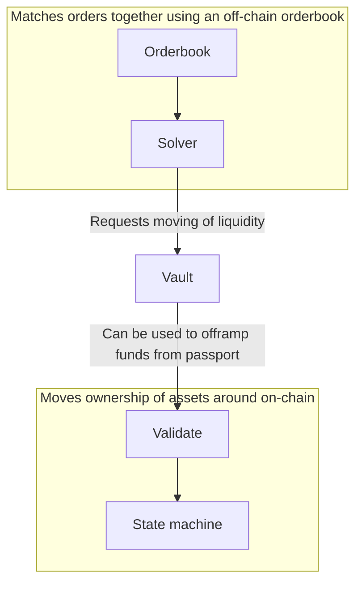
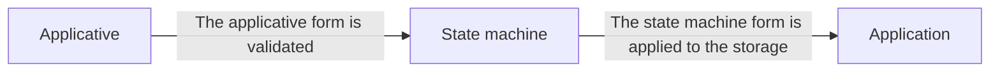

# Superposition Passport

Superposition Passport is a UTXO-based system of spending signatures given by the Matching
engine, which are then provided on-chain if the constraints are validated to the Solver
engine.

The application processes the type in `src/applicative.rs`, after a validation step. It
then confirms local balances, and gradually moves balances in different buckets
denominated by the hash of each step in the application.

## Diagram

### High level infrastructure diagram

### Passport diagram

