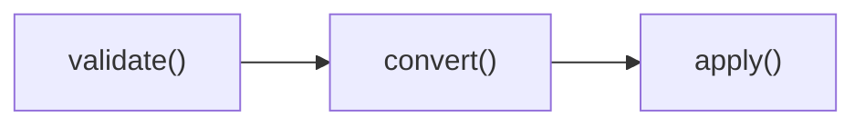
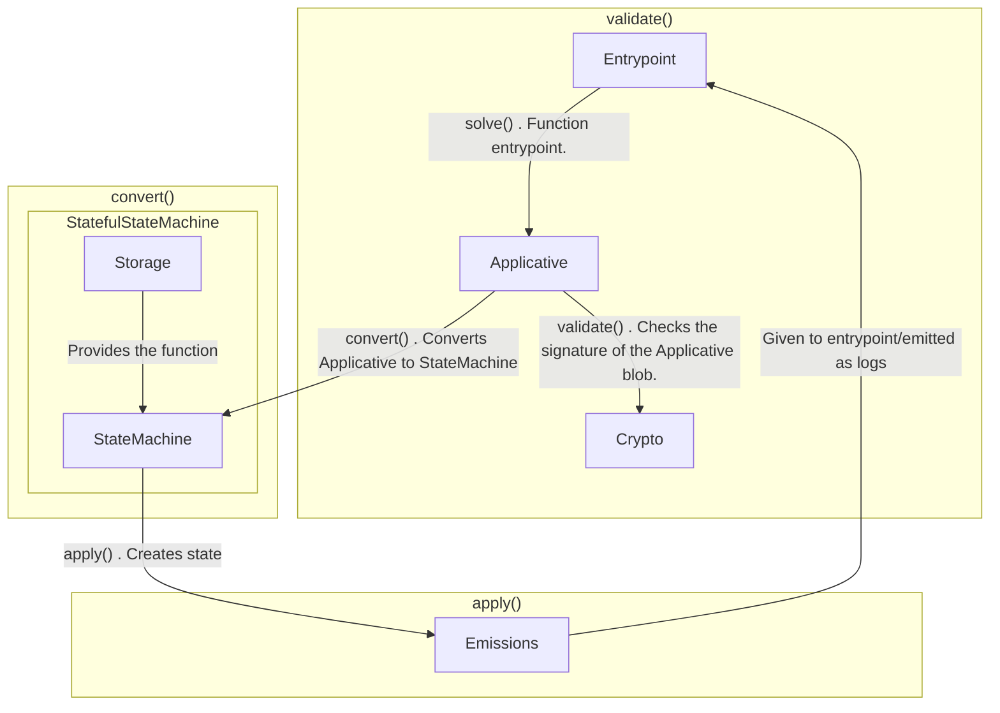

# Superposition Passport

Superposition Passport is a UTXO-based system of spending signatures given to the matching
engine, which are then provided on-chain if the constraints are validated to the Solver
engine. Balances are created with a timestamp, which is then hashed to create a snowflake,
which is then used to create new snowflakes as a derivative.

The conversion taking place internally is the conversion from the applicative from in
`src/applicative.rs`, to `src/state_machine.rs`, with the application taking place using a
local conversion dependent on the state to the local contract. Following the conversion,
the state is converted to a local type that is converted to the Emissions type, which is
able to be bundled and emitted.

The applicative module exports a function that can do signature verification and check if
the state transition function is valid with the validate function. A stateful conversion
using the methods attached to the storage type is needed to convert the `CreateBalance` in
the applicative form conversion to `StateBalance`.

## Why?

A few reasons, namely:

1. Immediate offramping using only signatures to any chain

2. Easy explicit parallelism

3. Easy privacy later using the same approach with inclusion proofs

4. Super affordable compression that can be scaled to include a optimistic approach

5. Simple once you understand

## Diagram

The actual behaviour of the state transition looks like this:


Emissions are consumed by the contract to produce side effects related to balances.
Storage is the contract itself. The Applicative type is provided to the contract to do the
conversion internally to the StateMachine. Conversions should only happen inside the
Solver contract. The applicative form conversion follows the following diagram:


With a conversion taking place from the applicative form by the solver to the internal
form, using the state inside the contract to support the conversion. It does the
conversion by looking at remaining balances after matching the applicative form. During
the Applicative form, the signatures are verified, and the state transition is validated.

But maybe it's better understood informally:

`storage.rs` is used with `state_machine.rs` to convert, then eventually consume, the
`applicative.rs` type, like this:



Which internally looks like the following:



So, solve is used as the entrypoint, which then kicks off validation of the signatures in
the applicative form, which then converts to the state machine form, which is then
persisted as state after conversion internally.

Each Balance is the creation of a snowflake for a user. It must be the timestamp it was
made from the user's point of view, and their address, hashed. The Solver contract
maintains an idea of the state of the Snowflake.

## Identifying the balances and their created derivatives

Identification is done using a Snowflake-like system of taking the user's timestamp and
their address, then keccak hashing it, then using the number as the snowflake as a
identifier.

When a recursively created derivative of a Balance creates a new Balance, a snowflake is
made. From the source:

```rust
/// Balances are identifiable in their descended form using the
/// concatenation of the previous hash, the timestamp of the change, and
/// the nonce here.
#[repr(C)]
pub enum SnowflakeNonce {
    CREATE_BALANCE,
    SPLIT_BALANCE_EXCESS,
    COMMIT_FULFILLED_LEFT,
    COMMIT_FULFILLED_RIGHT,
    COMMIT_EXCESS_LEFT,
    COMMIT_EXCESS_RIGHT,
}
```

So, a create balance would have the nonce of 0, and be created using `keccak256(address .
0 . nano timestamp)`. A split balance would have 1, and be of the form `keccak256(previous hash
. 1 . excess amount)` and so on.

## User stories

### Balance forking

#### Just the balance

Ivan goes to make a trade from ARB to OP. He asks for a price of $10, and has 5 ARB which
he wants to swap to OP, but last second he'll change his mind and only use 3 ARB. ARB and
OP are priced the same. Ivan creates the following Applicative structure:

	(Balance
	 <ivan sig>
	 (balance 'ARB 55244 5 'Ivan 1751349713))

This would be converted to this structure:

	(CreateBalance 'Ivan 'ARB 55244 5)

This results in a Snowflake of
`keccak256(abi.encodePacked(0x6221a9c005f6e47eb398fd867784cacfdcfff4e7,
uint128(1751349827449)))`. The result for the Solver contract to use to identify the state
of the Balance is `0x1177859b6194535e9e420abf7509a1dc4baee217eeae881188e09b4dfa54bc1f`.

#### Balance and orders

Ivan goes to place his newly created Balance on the market:

```scheme
(Order
 (order 3 'OP 55244 3)
 <ivan sig>
 (Balance
  <ivan sig>
  (balance 'ARB 55244 5 'Ivan 1751349713)))
```

This would be converted by the Solver to this structure during the `convert()` stage:

```scheme
(OrderCreated 'OP 55244 3
  (SplitBalanceSpendable
   (CreateBalance 'Ivan 'ARB 55244 5)	# This makes up the input.
   (CreateBalance 'Ivan 'ARB 55244 3)	# This is the spendable output from this.
   (CreateBalance 'Ivan 'ARB 55244 2)))	# This is the amount that could be reused.
```

In this situation, a new identifier would be made for the excess amount, which could be
reused to create a new balance like so. This would have the snowflake of
`keccak256(abi.encodePacked(bytes32(0x1177859b6194535e9e420abf7509a1dc4baee217eeae881188e09b4dfa54bc1f),
uint8(1), uint256(2)))`, aka
`0x2a48fd44c873f293067f14a14497ab3a7d54a6f4eef83d945ef277e1ad7d40f8`:

```scheme
(CreateBalanceOrigin
 (SplitBalanceSpendExcess
  (SplitBalance
   (CreateBalance 'Ivan 'ARB 55244 5)
   (CreateBalance 'Ivan 'ARB 55244 3)
   (CreateBalance 'Ivan 'ARB 55244 2))))	# This amount constitutes the balance of the CreateBalance here.
```

The solver knows the amount to fork off by keeping in mind the amounts available to be
spent by the Balance that were split in the past and being permissive, assuming that the
matching engine knows the correct amounts that can be spent (though it will check the
balances available to it assuming it has enough from what's committed in the past). This
translates into the matching engine knowing how much is available to be consumed.

#### Commitments (matching orders)

Knowing that Ivan has opted to spend his 3 ARB and the price is 1 to one, Eli has gone to
be the counterparty on his trade at a $1 price, but supplying 5 OP. Eli
constructs a Balance like the following:

```scheme
(Balance
 <eli sig>
 (balance 'OP 55244 5 'Eli 1751353972))
```

This would be converted to this structure for Eli:

```scheme
(CreateBalance 'Eli 'OP 55244 5)
```

Which he then wraps inside a Order:

```scheme
(Order (order 5 'ARB 55244 5)
 <eli sig>
 (Balance
 <eli sig>
 (balance 'OP 55244 5 'Eli 1751353972)))
```

Which is then translated to this type by the Solver:

```scheme
(OrderCreated 'ARB 55244 5
 (CreateBalance 'Eli 'OP 55244 5))
```

The solver sees that Ivan's order can be partially filled, and it creates the following
applicative structure from the two orders:

```scheme
(Commit
 <solver sig>
 (Order (order 5 'ARB 55244 5)
  <eli sig>
  (Balance
   <eli sig>
   (balance 'OP 55244 5 'Eli 1751353972)))
 (Order (order 3 'OP 55244 3)
  <ivan sig>
  (Balance
   <ivan sig>
   (balance 'ARB 55244 5 'Ivan 1751349713))))
```

This states "Eli wants to exchange his 5 ARB for 5 OP, we can't fill it completely, but
the Matcher thinks this is the best outcome we can give Eli and Ivan right now based on
the orderbook". It's translated literally by the Solver to the state machine type:

```scheme
(Commit
 (OrderCreated 'ARB 55244 5				# The first balance that was filled (Eli).
   (CreateBalance 'Eli 'OP 55244 5 1751353972))
 (OrderCreated 'OP 55244 3				# This is Ivan's 3 OP he spent.
  (SplitBalanceSpendable
   (CreateBalance 'Ivan 'ARB 55244 5 1751349713)
   (CreateBalance 'Ivan 'ARB 55244 3 1751349713)
   (CreateBalance 'Ivan 'ARB 55244 2 1751349713)))
 (CreateBalance 'Eli 'ARB 55244 3 1751355318)	# This is Eli's filled balance.
 (CreateBalance 'Ivan 'OP 55244 3 1751355318)	# This is Ivan's filled balance.
 (Some											# This is Eli's excess order creation.
  (OrderCreated 'ARB 55244 2
   (StateBalance (CreateBalance 'Eli 'OP 55244 2 1751353972))))
 (Some											# This is Ivan's excess order creation.
  (OrderCreated 'OP 55244 2
   (StateBalance (CreateBalance 'Ivan 'OP 55244 2 1751353972)))))
```

#### Reusing the match result of the order

Eli can begin the cycle anew by taking the result of his order commitment by taking the
amount that wasn't immediately rolled into a new order by using it to construct a Balance
like so:

```scheme
(CommitLeftExcessToBalance
 (Commit
  (OrderCreated 'ARB 55244 5
    (CreateBalance 'Eli 'OP 55244 5 1751353972))
  (OrderCreated 'OP 55244 3
   (SplitBalanceSpendable
    (CreateBalance 'Ivan 'ARB 55244 5 1751349713)
    (CreateBalance 'Ivan 'ARB 55244 3 1751349713)
    (CreateBalance 'Ivan 'ARB 55244 2 1751349713)))
  (CreateBalance 'Eli 'ARB 55244 3 1751355318)
  (CreateBalance 'Ivan 'OP 55244 3 1751355318)
  (Some
   (OrderCreated 'ARB 55244 2
    (StateBalance (CreateBalance 'Eli 'OP 55244 2 1751353972))))
  (Some
   (OrderCreated 'OP 55244 2
    (StateBalance (CreateBalance 'Ivan 'OP 55244 2 1751353972))))))
```
