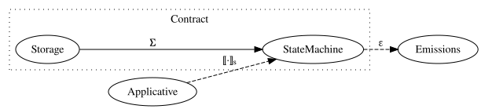
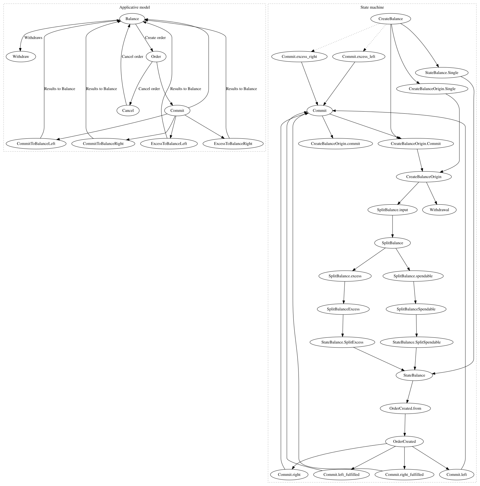
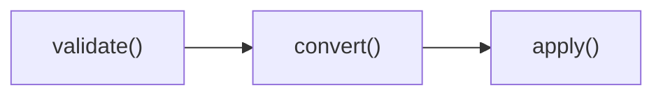
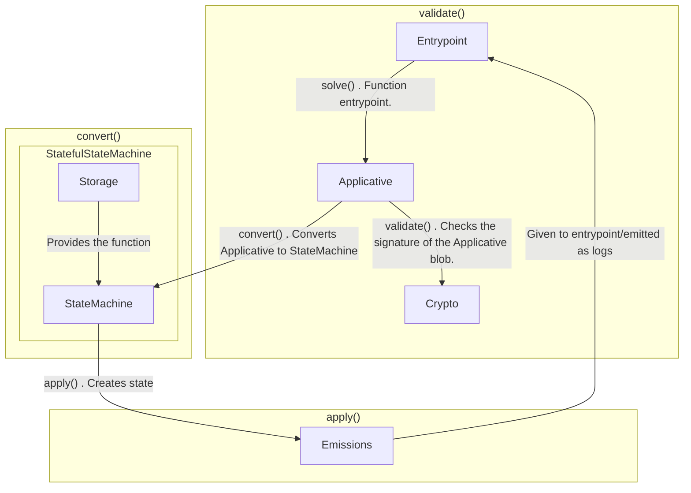

# Superposition Passport

Superposition Passport is a UTXO-based system of spending signatures given to the matching
engine, which are then matched if the constraints are validated, on-chain. Balances are
created with a timestamp, which is then hashed to create a snowflake, which is then
incremented to create partial orders based on the side that created an emission or
leftover amounts.

The conversion taking place internally is the conversion from the applicative from in
`src/applicative.rs`, to `src/state_machine.rs`, with the application taking place using a
local conversion dependent on the state to the local contract. Following the conversion,
the state is converted to a local type that is converted to the Emissions type, which is
able to be bundled and emitted.

The applicative module exports a function that can do signature verification and check if
the state transition function is valid with the validate function. A stateful conversion
using the methods attached to the storage type is needed to convert the `CreateBalance` in
the applicative form conversion to `StateBalance`.

## Diagram

The actual behaviour of the state transition looks like this:

The applicative form conversion follows the following diagram:

With a conversion taking place from the applicative form by the solver to the internal
form, using the state inside the contract to support the conversion. It does the
conversion by looking at remaining balances after matching the applicative form. During
the Applicative form, the signatures are verified, and the state transition is validated.

But maybe it's better understood informally:

`storage.rs` is used with `state_machine.rs` to convert, then eventually consume, the
`applicative.rs` type, like this:

Which internally looks like the following:

So, solve is used as the entrypoint, which then kicks off validation of the signatures in
the applicative form, which then converts to the state machine form, which is then
persisted as state after conversion internally.

Each Balance is the creation of a snowflake for a user. It must be the timestamp it was
made from the user's point of view, and their address, hashed. The Solver contract
maintains an idea of the state of the Snowflake.
