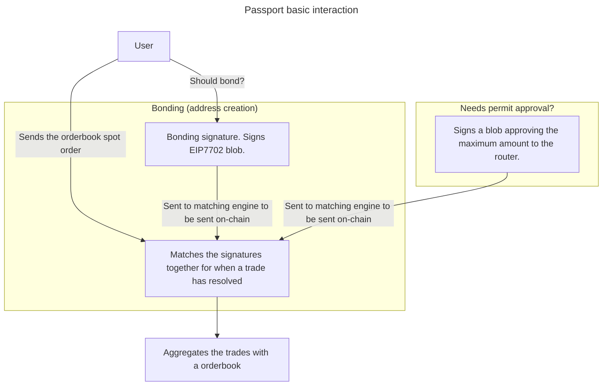

# Superposition Passport

```mermaid
---
title: Passport basic interaction
---
flowchart TD
	User -->|Should bond?| BondingSig
	SolvingEngine[Matches the signatures together for when a trade has resolved]
	User
	-->|Sends the orderbook spot order| SolvingEngine
	--> MatchingEngine[Aggregates the trades with a orderbook]
	subgraph "Bonding (address creation)"
		BondingSig[Bonding signature. Signs EIP7702 blob.]
		-->|Sent to matching engine to be sent on-chain| SolvingEngine
	end
	subgraph "Needs permit approval?"
		PermitSig[Signs a blob approving the maximum amount to the router.]
		-->|Sent to matching engine to be sent on-chain| SolvingEngine
	end
```
